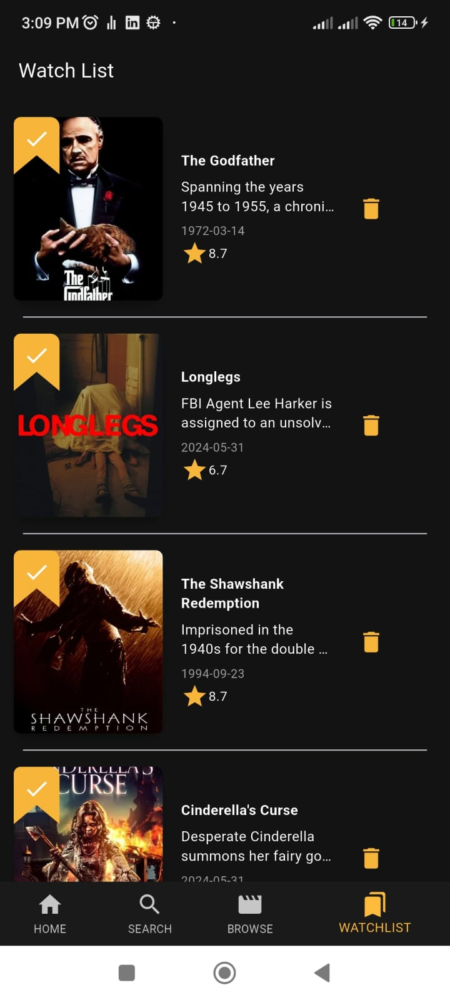

# Movies App

## Overview
The **Movies App** is a Flutter-based mobile application designed for movie enthusiasts. It allows users to browse, search, and explore various movies across different categories. Users can view detailed information about individual movies, manage their watchlist, and explore similar movies for a more immersive experience. The app provides a user-friendly and intuitive interface for browsing the latest releases and top-rated movies, along with personalized watchlist management.

## Features

### 1. **Splash Screen**
- **Functionality**: A visually appealing splash screen that showcases the app logo during startup, providing a smooth introduction to the app.

### 2. **Home Screen**
- **Sections**:
    - **New Releases**: Displays recently released movies, keeping users up to date with the latest in cinema.
    - **Top Rated**: Shows movies that have received the highest ratings from users and critics.
    - **Browse by Category**: Users can explore movies by category (e.g., Action, Comedy, Drama, etc.).

### 3. **Category Screen**
- **Functionality**: Users can browse movies by selecting a specific category from the "Browse Category" screen. Movies are filtered based on the genre and displayed with relevant details.
- **Design**: Grid layout for easy navigation through various categories like Action, Adventure, Animation, etc.

### 4. **Specific Category Screen**
- **Functionality**: Once a category is selected, movies related to that genre are displayed, each with a poster, title, release date, and rating. Users can tap on any movie for further details.
- **Design**: Clean and organized list layout with movie posters and essential details like movie title, rating, and release date.

### 5. **Movie Details Screen**
- **Functionality**: A dedicated screen for each movie that shows:
    - Movie title, release date, genre, and rating.
    - A brief description of the plot.
    - Similar or related movies for further discovery.
- **Design**: Visually engaging layout that presents all key movie details in an intuitive way.

### 6. **Search Screen**
- **Functionality**: A search interface where users can type in the name of a movie. The app retrieves relevant movies based on the query.
- **Design**: Includes a search bar and displays the results with posters, titles, and ratings.

### 7. **Saved Movies Screen (Watchlist)**
- **Functionality**: Users can save movies to a personalized watchlist. The saved movies screen shows all the movies the user has added, allowing them to easily access their favorite or intended-to-watch movies.
- **Design**: Organized and clear layout, presenting all saved movies in a scrollable list with essential details.

## Screenshots
### Splash Screen

### Home Screen

### Category Screen

### Specific Category Screen

### Movie Details Screen

### Search Screen

### Saved Movies (Watchlist) Screen

## Technology Stack
- **Frontend**: Flutter (Dart)
- **Backend**:API for movies and Firebase  saving movies in watchlist
- **State Management**: Provider

## How to Install and Run the App
1. Clone the repository.
2. Ensure you have Flutter installed on your local machine.
3. Run `flutter pub get` to install the necessary dependencies.
4. Use `flutter run` to launch the app on an emulator or physical device.
